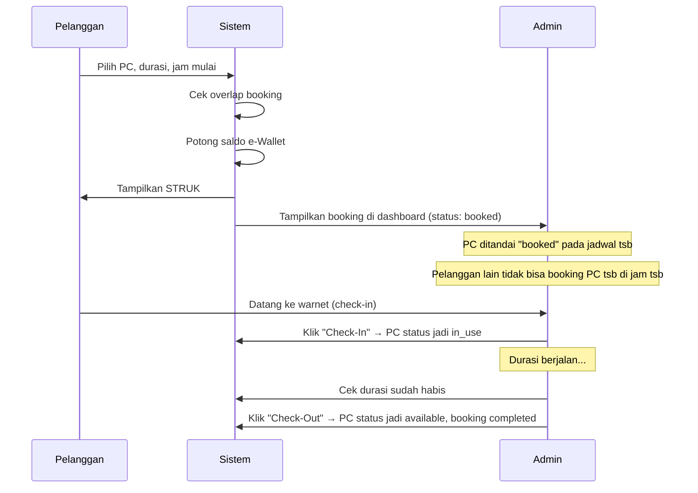

# Rombak Flow Booking — Admin Manual Check-in/Check-out

## Deskripsi Masalah

Flow booking saat ini menggunakan sistem **otomatis**: scheduler (`ProcessBookings`) auto-aktivasi booking saat `start_time` tercapai dan auto-complete saat `end_time` habis. User juga bisa cancel booking & end session sendiri. Ini perlu diubah menjadi flow **manual oleh admin**.

## Flow Baru yang Diinginkan



## Proposed Changes

### Status Flow Baru

| Status | Artinya | Trigger |
|--------|---------|---------|
| `booked` | Pelanggan sudah bayar, PC sudah dipesan pada jadwal tsb | Pelanggan submit booking |
| `active` | Admin sudah check-in, PC sedang digunakan | Admin klik "Check-In" |
| `completed` | Admin sudah check-out, sesi selesai | Admin klik "Check-Out" |

> [!IMPORTANT]
> Status `pending` dihapus/diubah menjadi `booked` agar lebih jelas. Booking baru langsung berstatus `booked` (sudah dibayar).

---

### Database Migration

#### [NEW] Migration: Update bookings status enum

- Ubah enum status dari `['pending', 'active', 'completed']` → `['booked', 'active', 'completed']`
- Data lama dengan status `pending` diubah ke `booked`

---

### Backend — Controllers

#### [MODIFY] [UserController.php](file:///c:/Users/yoru/.gemini/antigravity/scratch/Rental%20warnet%20laravel/app/Http/Controllers/UserController.php)

**Perubahan:**
- `home()`: Hapus panggilan `Artisan::call('bookings:process')`. Ganti filter status `pending` → `booked`.
- `billing()`: Ganti cek `pending` → `booked`. **Hapus batasan 1 booking aktif** — pelanggan boleh punya multiple bookings selama tidak overlap.
- `processBilling()`: Status booking berubah dari `'pending'` → `'booked'`. Overlap check tetap ada tapi cek status `['booked', 'active']`. **Tidak perlu ubah PC status** saat booking (PC status hanya diubah oleh admin).
- **Hapus** `cancelBooking()` dan `endSession()` — user tidak bisa cancel/end sendiri.
- **Hapus** `book()` dan `store()` — fungsi duplikat dari billing.
- `billingSuccess()`: Update referensi status.

#### [MODIFY] [AdminController.php](file:///c:/Users/yoru/.gemini/antigravity/scratch/Rental%20warnet%20laravel/app/Http/Controllers/AdminController.php)

**Perubahan:**
- `bookingIndex()`: Tampilkan semua booking, load canteen items relation. Tambah info waktu booking di setiap row.
- **Ganti** `finishBooking()` → `checkinBooking()` dan `checkoutBooking()`:
  - `checkinBooking($id)`: Ubah booking status `booked` → `active`, PC status → `in_use`.
  - `checkoutBooking($id)`: Ubah booking status `active` → `completed`, PC status → `available`.
- `pcIndex()`: Tambahkan data booking aktif/terjadwal ke setiap PC agar admin bisa lihat jadwal booking per PC.

---

### Backend — Lainnya

#### [MODIFY] [ProcessBookings.php](file:///c:/Users/yoru/.gemini/antigravity/scratch/Rental%20warnet%20laravel/app/Console/Commands/ProcessBookings.php)

- **Hapus semua logika auto-aktivasi dan auto-complete.** Command ini tidak diperlukan lagi karena semua status diubah manual oleh admin.

---

### Routes

#### [MODIFY] [web.php](file:///c:/Users/yoru/.gemini/antigravity/scratch/Rental%20warnet%20laravel/routes/web.php)

**Hapus:**
- `user.book`, `user.store` — fungsi booking duplikat
- `user.cancel_booking` — user tidak bisa cancel
- `user.end_session` — user tidak bisa end session

**Tambah:**
- `POST admin/bookings/{id}/checkin` → `admin.bookings.checkin`
- `POST admin/bookings/{id}/checkout` → `admin.bookings.checkout`

**Ganti:**
- `POST admin/bookings/{id}/finish` → dihapus, diganti oleh checkin & checkout

---

### Frontend — User Views

#### [MODIFY] [home.blade.php](file:///c:/Users/yoru/.gemini/antigravity/scratch/Rental%20warnet%20laravel/resources/views/user/home.blade.php)

- **Hapus** "Menunggu Check-In" ticket view (auto-checkin logic sudah tidak ada)
- **Hapus** "Online View" dengan timer + "Akhiri Sesi" button
- **Ganti** tampilan jadi daftar booking aktif user (bisa multi-booking):
  - Booking `booked`: Tampilkan kartu tiket dengan detail PC, jadwal, durasi. Tanpa tombol cancel.
  - Booking `active`: Tampilkan kartu "Sedang Bermain" (PC, sisa waktu)
- Riwayat tiket tetap di bawah

#### [MODIFY] [billing.blade.php](file:///c:/Users/yoru/.gemini/antigravity/scratch/Rental%20warnet%20laravel/resources/views/user/billing.blade.php)

- Hapus class `in-use` dari PC grid — karena status in_use di PC level tidak lagi dipakai untuk validasi billing. Validasi cuma pakai booking overlap.
- Tetap bisa pilih PC (yang tidak ada booking overlap)

#### [MODIFY] [billing_success.blade.php](file:///c:/Users/yoru/.gemini/antigravity/scratch/Rental%20warnet%20laravel/resources/views/user/billing_success.blade.php)

- Ganti badge "Menunggu Check-In" → "Booking Dikonfirmasi"
- Ganti info text tentang auto-start → pesan untuk datang sesuai jadwal

#### [MODIFY] [receipt.blade.php](file:///c:/Users/yoru/.gemini/antigravity/scratch/Rental%20warnet%20laravel/resources/views/user/receipt.blade.php)

- Update status badge references dari `pending` → `booked`

#### [MODIFY] [receipt_pdf.blade.php](file:///c:/Users/yoru/.gemini/antigravity/scratch/Rental%20warnet%20laravel/resources/views/user/receipt_pdf.blade.php)

- Update status badge references dari `pending` → `booked`

#### [DELETE] [book.blade.php](file:///c:/Users/yoru/.gemini/antigravity/scratch/Rental%20warnet%20laravel/resources/views/user/book.blade.php)

- View duplikat yang tidak dipakai lagi.

---

### Frontend — Admin Views

#### [MODIFY] [booking_index.blade.php](file:///c:/Users/yoru/.gemini/antigravity/scratch/Rental%20warnet%20laravel/resources/views/admin/booking_index.blade.php)

- Ganti tombol "Force Stop" → 2 tombol berdasarkan status:
  - Status `booked`: Tombol **"Check-In"** (hijau) — admin klik saat pelanggan datang
  - Status `active`: Tombol **"Check-Out"** (merah) — admin klik saat durasi habis + info sisa waktu/durasi
  - Status `completed`: Badge "Selesai" (tetap)
- Tambahkan kolom status yang menampilkan badge status booking

#### [MODIFY] [pc_index.blade.php](file:///c:/Users/yoru/.gemini/antigravity/scratch/Rental%20warnet%20laravel/resources/views/admin/pc_index.blade.php)

- Tambahkan kolom "Booking Terdekat" di tabel PC untuk menampilkan jadwal booking yang akan datang per PC (nama user, jam mulai – selesai)
- Tambah status `booked` di badge (selain available dan in_use)

---

## Verification Plan

### Automated Tests
```bash
php artisan route:list
php artisan view:cache && php artisan view:clear
```

### Manual Verification
- Login sebagai user → booking PC → cek struk muncul
- Login sebagai admin → cek booking muncul di daftar → klik Check-In → PC status berubah
- Cek bahwa user lain tidak bisa booking PC yang sama di jam yang overlap
- Admin klik Check-Out → booking completed, PC available
